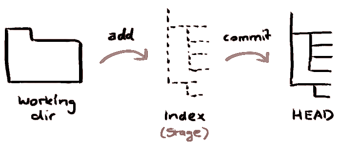

# Introducción a GitHub
En los siguientes pasos aprenderás a clonar un repositorio remoto por SSH.

## Pasos para acceder por SSH a GitHub:
### 1. Instalación
En GNU/Linux la instalación se resume a:
```
$ sudo apt-get install git
```
### 2. Uso de GIT
Lo primero que necesitamos para poder usar GIT de manera distribuida, es contar con un repositorio, en el cual vamos a mantener nuestros archivos versionados.

Por lo general existen 3 casos de uso básicos:
* **Caso 1: crear un repositorio:** Vamos a comenzar un proyecto el cual todavía no tiene su primera línea de código o ningún otro tipo de archivo.
* **Caso 2: clonar un repositorio:** Tenemos un repositorio creado en el servidor (Github, Bitbucket, etc) pero no lo tenemos en nuestra máquina local, por lo que tenemos que descargar el proyecto para continuarlo localmente. Este es nuestro caso.
* **Caso 3: agregar un remoto:** En el cual ya tenemos un serie de archivos locales los cuales queremos subir a un repositorio nuevo en el servidor.

### 3. Métodos de conexión
La mayoría de los servidores de control de versiones con GIT permiten la conexión de dos maneras:
* Por medio de claves SSH y
* por medio de HTTPS

La más sencilla de las dos es el uso de HTTPS, aunque no siempre será la más cómoda de usar, sobre todo por la solicitud de clave de usuario al servicio. Pero es la más ventajosa en caso que estéis trabajando en una computadora de la cual no sois
propietarios.

El **uso de las claves SSH** es la manera más segura y estable de usar GIT. El detalle es que para utilizar este método necesitamos contar con claves SSH en nuestra máquina.

#### 3.1. Generar una nueva clave de SSH
1. Abre un Terminal.

2. Pega el siguiente texto a continuación, sustituyendo en la dirección de correo electrónico por la tuya.
```
$ ssh-keygen -t rsa -b 4096 -C "usuario@iespenyagolosa.es"
```
Esto crea una nueva clave SSH, utilizando el correo electrónico proporcionado como una etiqueta.

3. Cuando te pida "Introducir un archivo en el que guardar la clave", pulsa la tecla Intro. Este acepta la ubicación predeterminada del archivo.
Introduce un archivo en el que guardar la clave *(/home/usuario/.ssh/id_rsa)*: [Pulsa Intro]

4. Cuando te lo pida, escribe una contraseña segura.

#### 3.2. Añadiendo la clave a ssh-agent para que no te la pida cada vez

1. Inicia el ssh-agent en el background.

```
$ eval "$(ssh-agent -s)"
```

2. Añade tu clave privada SSH a ssh-agent.

```
$ ssh-add ~/.ssh/id_rsa
```

3. Añade la clave SSH para la cuenta de github. Copia la clave SSH en el portapapeles.

```
$ sudo apt-get install xclip
$ xclip -sel clip < ~/.ssh/id_rsa.pub
```

4. Ahora inicia sesión en tu [cuenta de github](https://www.github.com) o créate una si aún no la tienes. *Recuerda usar el mismo e-mail que has utilizado antes.*

1. En la esquina superior derecha de cualquier página, haz clic en tu foto de perfil, a continuación, haz clic en **Settings**.

2. En la barra lateral configuración de usuario, haz clic en las **claves SSH y GPG**.

3. Haz clic en la tecla **New SSH key** o Añadir clave SSH.

4. En el campo "Título", añade una etiqueta descriptiva para la nueva clave. Por ejemplo, “Ordenador de clase”.

5. Pegar la clave en el campo "Clave".

6. Haz clic en **Agregar clave SSH**.

7. Si te lo solicita, confirma tu contraseña de GitHub.

### 4. Clonar el repositorio de nuestro proyecto.

Vamos a los comandos de consola:

1. Primero vamos a asegurarnos de estar en la carpeta Home del Usuario.
```
$ cd ~/
```

2. Creamos una carpeta de proyectos donde vamos a agregar todos nuestros proyectos con GIT (este paso no es obligatorio).
```
$ mkdir proyectos_git
$ cd proyectos_git
```
3. A continuación clonamos el repositorio remoto.
```
$ git clone git@github.com:iespenyagolosa/controlaccesos.git
```

## Flujo de trabajo
Tu repositorio local esta compuesto por tres "árboles" administrados por git. El primero es tu **Directorio de trabajo** que contiene los archivos, el segundo es el **Index** que actua como una zona intermedia, y el último es el **HEAD** que apunta al último commit realizado.



4. Ahora podemos modificar cualquiera de los archivos del proyecto. Una vez modificado uno o varios archivos, este archivo debe pasar por la fase de Estate, es decir, marcarlo para el próximo commit
```
$ git add ficheroModificado.xxx
```
o también podemos añadir todos los archivos y subcarpetas:
```
$ git add .
```

6. Hacemos el commit: guardamos los cambios en la línea de tiempo del proyecto
```
$ git commit -m 'Comentario acerca de los cambios realizados'
```
Actualmente el archivo esta incluído en el HEAD, pero aún no en tu repositorio remoto.

7. Ahora necesitamos subir los cambios al repositorio remoto.
```
$ git push origin master
```
8. En caso de que otra persona suba un cambio al servidor, y debamos descargarlo a nuestro equipo local, usaremos el comando pull.
```
$ git pull origin master
```

### 5. El trabajo colaborativo
El verdadero poder de servicios como GitHub se hace evidente cuando se inicia el trabajo con otras personas. GitHub permite que otras personas hagan sus propias copias de sus proyectos, o para hacer modificaciones de los mismos. Cualquiera puede hacer mejoras en el proyecto y luego haga las mejoras hasta GitHub para que todos puedan compartir.

Hay dos formas principales para que os involucreis en proyectos de otras personas: **issues** y **pull requests**.
#### 5.1. Issues:
Es posible detectar un error en una parte del código de algún desarrollador, y ahí es donde pdemos ayudar iniciando un comentario o cuestión (issue) haciendo clic en la pestaña issues.

#### 5.2. Pull requests:
Si aun queremos ayudar más que con un comentario, podemos hacer una pull request, que consiste en que nos descargamos una copia local del repositorio, corregimos lo que consideramos que está mal y volvemos a subir nuestra copia corregida.
